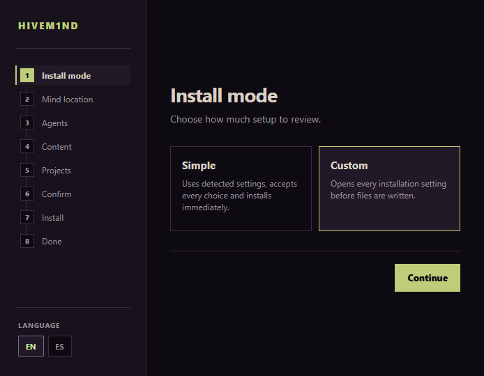

<div align="center">
  

  # HIVEM1ND

  One mind for every coding agent.

  [](https://github.com/txmska742/HIVEM1ND/releases/latest)
  [](LICENSE)
  [](https://github.com/txmska742/HIVEM1ND/actions/workflows/ci.yml)

  [Download](https://github.com/txmska742/HIVEM1ND/releases/latest) &middot;
  [Quick start](#quick-start) &middot;
  [Commands](#commands) &middot;
  [Docs](files.md) &middot;
  [Links](https://txmska.com/links) &middot;
  [Support](#support)
</div>

<p align="center">
  
</p>

## What it is

HIVEM1ND is a folder of plain markdown that any coding agent can read and write. Context, memory, preferences and work in progress carry over across projects and machines instead of resetting with every chat. Roles, commands, features and knowledge modules are files, so there is no database, lock or index, and any agent or app can read the folder directly. Every supported agent attaches to the same mind through its own adapter, and an agent without one gets a generic attach prompt.

## Quick start

| Method | Steps |
| --- | --- |
| Windows | Download `HIVEM1ND-<version>-x64.zip` from [Releases](https://github.com/txmska742/HIVEM1ND/releases/latest), extract it, run `HIVEM1ND\HIVEM1ND.exe`. |
| npx | `npx hivem1nd init` opens the terminal wizard; add `--gui` for the browser wizard. |
| Clone | Clone this repository into the folder that will hold the mind. That is the install, with no setup step. |
| Genesis | Paste the [setup prompt](roles/genesis.md) into any agent chat and it runs the setup in plain language. |

All four ask the same questions in the same order and resume where a previous attempt stopped.

The Windows build is unsigned, so SmartScreen may warn before the first run, and Smart App Control blocks it outright. The `npx hivem1nd` command becomes available once a version is published to npm; the clone and Genesis paths work regardless.

## How it works

HIVEM1ND is organized in nodes, an inverted tree with the mind at the top.

```text
mind (one per user)
 └─ environment (optional, groups repos of one kind)
     └─ repo (an executor works here)
```

The hive is the mind itself: one per user, holding roles, commands, features and knowledge modules, plus everything its agents learn. An environment groups repos of one kind, such as a game engine or a web stack, and its coordinator runs at that level. A repo is the leaf, where an executor works, with a brief describing what it is and where its design document is located. A repo or an environment can hold a local instance too, a committed folder with overrides for that node.

Any agent attaches in one of two modes. In on-demand mode nothing loads by itself; a command starts a chat in a role, and from there the agent works with the mind's context. In auto mode every new chat has HIVEM1ND loaded without running anything, through one line added to the agent's own rules file.

## Setup steps

| # | Step | What it asks |
| --- | --- | --- |
| 1 | Install mode | Simple accepts every detected default and installs immediately; Custom opens every setting first. |
| 2 | Mind location | The root folder for the mind: local, a cloud drive, a pendrive or a network location. |
| 3 | Agents | Scans the machine and sets how each agent loads HIVEM1ND, on-demand or auto. |
| 4 | Content | Which features and knowledge modules to include. |
| 5 | Projects | Confirms roots, optional environments and repositories. |
| 6 | Confirm | Optional preferences and whether to check for updates automatically. |
| 7 | Install | Reviews every change and resolves conflicts before anything is written. |
| 8 | Done | Prints what was written and the first command to run. |

## Reference

### Roles

A role is a markdown file in `roles/`, and that file is also the command that starts a chat in that role. See [roles/README.md](roles/README.md).

<details>
<summary>Executive and operative roles</summary>

| Role | Group | Description |
| --- | --- | --- |
| Overseer | Executive | Coordinates the whole swarm as the product owner; talks to the user, decides and distributes the work. |
| Technician | Executive | Responsible for the machine and the tooling, as the tech lead. |
| Genesis | Executive | Installs the mind on a machine and maintains it afterward. |
| Overlord | Operative | Coordinates one environment as the project manager, for a change that spans several repos. |
| Executor | Operative | Executes tasks inside one repo, one at a time. The default seat for a repo. |
| Super executor | Operative | The Executor seat on the strongest model available, for tasks that require it. |
| Consultant | Operative | Reads, explains and reviews inside one repo and never writes. |

</details>

### Commands

Every role is a command, and a few more operate the system. Every command also works in plain language: telling an agent to start as an executor does the same as `/executor`. See [commands/README.md](commands/README.md).

<details>
<summary>System commands</summary>

| Command | Description |
| --- | --- |
| `/relay` | Starts and ends a role's session. On entry it reads the state and the inbox; on exit it writes the state and the log. |
| `/evolve` | Updates the mind base, applies private migrations in order and reinstalls the included commands for this machine. |
| `/task` | Creates a task file with the next id for a unit and leaves it a message that the task is ready. |
| `/msg` | Writes a message into a unit's inbox and, when its agent has a CLI and the unit is in, tells it to read the inbox. |
| `/absorb` | Stores a piece of feedback as a preference, for the current project or globally, with the date and the reason. |
| `/pylon` | Adds shared team state to a repository without switching or changing its code branch. |
| `/swarm` | Lists every active unit, open or delivered task, and unread inbox in the mind. |
| `/uninstall` | Removes what was installed on this machine: commands, skills and the auto rule line for each attached agent. |
| `/protocol` | Creates or runs a protocol: a strict sequence of steps, each with a task, a time and a result. |

</details>

### Features

A feature is a workflow that runs on a repo, with a start and an end, one markdown file in `features/`. Most are included in the base; the rest are installed with a knowledge module and require it.

<details>
<summary>Eleven features</summary>

| Feature | Category | Description |
| --- | --- | --- |
| `/report` | Planning | Investigates a defect or request and writes an evidence-backed task for the project executor without changing code. |
| `/plan` | Planning | Splits a request into ordered task files for the owning units and sends each unit a message without implementing it. |
| `/brainstorm` | Planning | Develops a topic one approved decision at a time and records agreed text separately from open questions. |
| `/qa` | Quality | Runs every open project task in non-overlapping groups, verifies the results and records what passed or failed. |
| `/tribunal` | Quality | Convenes three judges, cross-examines their findings and records an evidence-backed verdict without editing code. |
| `/corpo` | Quality | Stress-tests delivered work with three deliberately difficult reviewers and records every finding for the user. |
| `/observer` | Quality | Tests a project under adverse conditions and writes reproducible weakness reports as open tasks. |
| `/conflicts` | Quality | Resolves compatible merge or rebase conflicts, asks about incompatible hunks and verifies the build before completion. |
| `/catchup` | Continuity | Summarizes changes, authors, open work and unread messages since the unit's recorded state without changing files. |
| `/docs` | Continuity | Updates only the documentation affected by the current diff or a supplied commit range. |
| `/release` | Continuity | Prepares a local release from commits since the last tag and reports the commands needed to publish it. |

</details>

## Files

Everything in the mind is stored as files, one record per file: a brief per project, a state file per unit, a message per inbox entry, a task per request, a log per repo, environment and mind, plus preferences and knowledge modules. The full layout and every record format are in [files.md](files.md).

## Working together

Several people can share a repo, each with their own mind. The team's shared state, presence, messages, tasks and log, is stored on a dedicated branch of the same repo, mounted in a folder the code branches ignore. Work happens on branches, and main changes through pull requests that a person merges; an agent commits and pushes on its own task branch and nowhere else. AI presence, whether commits carry AI trailers and whether shared files are allowed, is decided by the team once per repo.

## Updating and uninstalling

`/evolve` pulls the new version into the mind, translates roles and features into the format of each attached agent, and migrates `user/` when the structure changed. Anything left out at setup stays out on later updates.

To remove what was installed on a machine, run `uninstall.cmd` in the mind folder, `hivem1nd uninstall [--dry-run] [--remove-mind]` from a terminal, or `/uninstall` from an attached agent. A dry run reports the plan before anything is removed.

## Troubleshooting

**Windows warns about an unknown publisher, or blocks the app outright.** The build is unsigned. SmartScreen shows a warning that can be dismissed with "Run anyway"; Smart App Control blocks unsigned software entirely and has no per-app exception, so it must stay off to run the packaged app.

**Node.js version errors.** HIVEM1ND requires Node.js 22 or later. Check the installed version with `node --version` before running `npx hivem1nd init`.

**Where is the mind.** In auto mode, the HIVEM1ND line in each agent's rules file names its path. Inside the mind, `user/machines/<host>.md` records it under the `mind` field, one file per machine.

**Starting over.** Run the setup again with `--resume` to continue an interrupted attempt, or uninstall first and run it again from scratch.

## Contributing

One pull request per change, the merge is a maintainer's decision. See [CONTRIBUTING.md](CONTRIBUTING.md) for the format of roles, commands, features and knowledge modules.

## License

[MIT](LICENSE).

## Support

More links: [txmska.com/links](https://txmska.com/links).

[](https://buymeacoffee.com/txmska)
